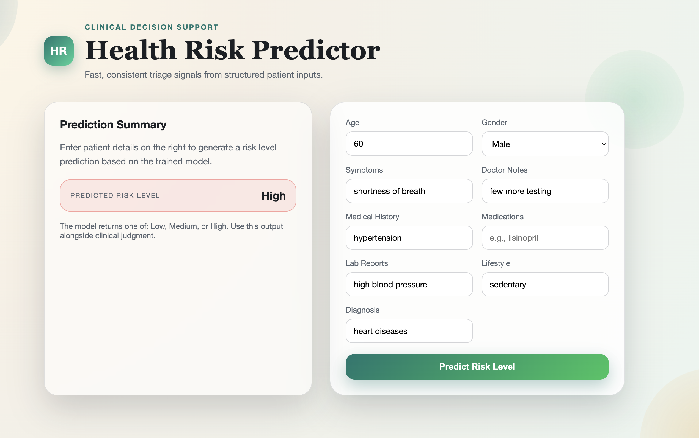

# Health Risk Predictor

A machine learning–based clinical decision support system that predicts patient risk levels (Low, Medium, High) from structured health data.

---

## Overview

This project implements an end-to-end ML pipeline with:

- Data preprocessing and feature engineering  
- Model training and evaluation  
- Inference pipeline  
- Web-based UI  
- Azure deployment  

It simulates a real-world healthcare triage tool.

---

## Workflow

1. User inputs patient data via UI  
2. Data is validated and preprocessed  
3. Model predicts risk level  
4. Result is displayed instantly  

---

## UI



---

## Deployment

- Hosted on Azure  
- Backend served via API (Flask/FastAPI)  
- UI connected to model endpoint  
- Optional Docker support  

---

## Project Structure

```
ml-pipeline-health-risk-predictor/
│
├── data/
├── notebooks/
├── src/
│   ├── data/
│   ├── features/
│   ├── models/
│   └── pipeline/
│
├── app/
│   ├── backend/
│   └── frontend/
│
├── models/
├── deployment/
├── tests/
│
├── requirements.txt
└── README.md
```

---

## Tech Stack

- Python (Pandas, Scikit-learn)  
- Flask / FastAPI  
- HTML/CSS  
- Azure  
- Docker (optional)  

---

## Model

- Type: Multi-class classification  
- Output: Low / Medium / High  
- Inputs: demographics, symptoms, medical history, lifestyle  

---
